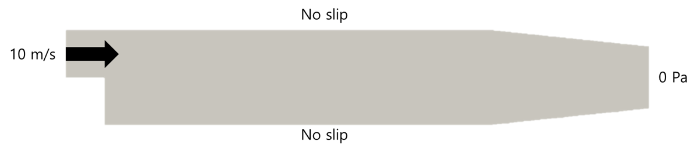

# OpenFOAM 폴더 구조

## OpenFOAM 폴더 구조

이번 시간에는 OpenFOAM의 폴더 구조에 대해 알아본다.<br>
OpenFOAM은 다른 상용 CFD SW와는 다르게 완전히 폴더 구조로 되어있다.<br>
그 구조를 잠깐 살펴보자면 아래와 같다.<br>

```plaintext
case/
 ├── 0         ← time directory
 ├── constant
 └── system
```

Case 안에 Time directory (0번 폴더 포함), Constant 폴더, System 폴더가 각각 들어있다.<br>
그러면 각 폴더 별로 기능을 알아보자.<br>

## Time directory

Time directory는 계산 횟수 혹은 시간에 따른 해석 결과가 (field data : U, p, T 등) 저장된다.<br>
초기 조건은 보통 0에 저장되며, 이는 시작 시간에 대한 값을 설정하는 곳이다.<br>

```plaintext
0/
 ├── U         ← 속도 초기조건
 ├── p         ← 압력 초기조건
 └── T         ← 온도 (필요한 경우)
```

0번 폴더는 위 구성과 같이 U, p, T, k, nut등 물리량(필드) 파일들로 이루어지며 경계 조건이 정의된다.<br>
해석이 진행되면 time에 따라 새로운 디렉토리가 생성되고, 각각 해당 time에 해당되는 필드들을 가지고 있다.<br>
그리고 paraview에서는 위 파일에 저장되어 있는 필드들을 보여준다.<br>

## constant

격자에 대한 설정과 물성 및 정보 등을 저장한다.<br>
```plaintext
constant/
 ├── polyMesh                     ← 격자 정보 (boundary, points, faces, owner, ...)
 ├── transportProperties          ← 유체 물성 (점성 계수 등)
 └── turbulenceProperties         ← 난류 모델 정보 (RAS, LES 등)
```
polyMesh 폴더는 blockMesh, snappyHexMesh 등으로 생성되며, 격자 정보를 가지고 있다.<br>
transportProperties에는 점성, 밀도, 열전도도 등 유체의 물성치들이 저장된다.<br>
turbulenceProperties에는 난류 모델 정보가 저장된다.<br>
이 외에도 MRFProperties, dynamicMeshDict등 동적 격자 (움직이는 격자)의 정보가 저장된다.<br>

## system

해석에 필요한 수치 기법이나 해석을 제어하는 설정들이 들어가있다.<br>

```plaintext
system/
 ├── controlDict        ← 격자 정보 (boundary, points, faces, owner, ...)
 ├── fvSchemes          ← 유체 물성 (점성 계수 등)
 └── fvSolution         ← 난류 모델 정보 (RAS, LES 등)
```

controlDict는 계산 횟수, 저장 간격, solver 이름 등을 정의한다.<br>
fvSchemes는 이산화 방법을 정의한다.<br>
fvSolution은 수렴 조건이나 under-relaxation factor등을 정의한다.<br>

그러면 실제 예제를 풀면서 구조에 대해 자세하게 알아보자.<br>
예제는 simpleFoam의 pitzDaily 예제이다.<br>

## pitzDaily 예제

### pitzDaily 예제 개요

pitzDaily는 



### pitzDaily 폴더 구조
pitzDaily 예제의 초기 폴더 구조는 아래와 같다.<br>

```plaintext
case/
 ├── 0
 ├── constant
 └── system
```

각 폴더 별 내용을 알아본다.

1. 0

0번 폴더는 초기 조건을 담은 폴더이다.<br>
대표적으로 U와 p에 대해 살펴보자.<br>

### U
```
/*--------------------------------*- C++ -*----------------------------------*\
| =========                 |                                                 |
| \\      /  F ield         | OpenFOAM: The Open Source CFD Toolbox           |
|  \\    /   O peration     | Version:  v2412                                 |
|   \\  /    A nd           | Website:  www.openfoam.com                      |
|    \\/     M anipulation  |                                                 |
\*---------------------------------------------------------------------------*/
FoamFile
{
    version     2.0;
    format      ascii;
    class       volVectorField;
    object      U;
}
// * * * * * * * * * * * * * * * * * * * * * * * * * * * * * * * * * * * * * //

dimensions      [0 1 -1 0 0 0 0];

internalField   uniform (0 0 0);

boundaryField
{
    inlet
    {
        type            fixedValue;
        value           uniform (10 0 0);
    }

    outlet
    {
        type            zeroGradient;
    }

    upperWall
    {
        type            noSlip;
    }

    lowerWall
    {
        type            noSlip;
    }

    frontAndBack
    {
        type            empty;
    }
}


// ************************************************************************* //
```

우선
```
internalField uniform (0 0 0);
```
위 내용은 전체 격자에 대해 초기 속도를 (0 0 0)으로 지정한다는 의미이다.<br>

```
 inlet
    {
        type            fixedValue;
        value           uniform (10 0 0);
    }
```
그리고 inlet에 속도를 fixedValue 즉, 고정된 값을 정의하고 속도 크기는 (10 0 0) x축으로 10m/s를 정의한다.<br>

```
 outlet
    {
        type            zeroGradient;
    }
```
outlet은 zeroGradient로 출구 경계면에서 속도값은 마지막 셀의 중심과 구배가 없는 (Zero Gradient) 값을 쓴다.<br>
쉽게 말해 마지막 셀의 중심 값을 그대로 사용한다는 의미이다.<br>

```
upperWall
    {
        type            noSlip;
    }
```
upperWall과 lowerWall에 대해 noSlip으로 설정되어 있다.<br>
이는, 벽은 점착 조건(no slip) 조건으로 경계조건을 설정한다는 의미이다.<br>

```
frontAndBack
    {
        type            empty;
    }
```
마지막으로 frontAndBack은 empty로 설정되어 있다.<br>
이는, z축에 수직인 평면은 비어있다는 의미로 3차원이 아닌 2차원 격자임을 나타낸다.<br>

### p
```
/*--------------------------------*- C++ -*----------------------------------*\
| =========                 |                                                 |
| \\      /  F ield         | OpenFOAM: The Open Source CFD Toolbox           |
|  \\    /   O peration     | Version:  v2412                                 |
|   \\  /    A nd           | Website:  www.openfoam.com                      |
|    \\/     M anipulation  |                                                 |
\*---------------------------------------------------------------------------*/
FoamFile
{
    version     2.0;
    format      ascii;
    class       volScalarField;
    object      p;
}
// * * * * * * * * * * * * * * * * * * * * * * * * * * * * * * * * * * * * * //

dimensions      [0 2 -2 0 0 0 0];

internalField   uniform 0;

boundaryField
{
    inlet
    {
        type            zeroGradient;
    }

    outlet
    {
        type            fixedValue;
        value           uniform 0;
    }

    upperWall
    {
        type            zeroGradient;
    }

    lowerWall
    {
        type            zeroGradient;
    }

    frontAndBack
    {
        type            empty;
    }
}


// ************************************************************************* //
```

U와 비슷하게 내용이 작성되어 있다.

internalField는 0, inlet과 wall은 zeroGradient, outlet은 uniform 0으로 설정되어 있다.<br>
즉, 초기 압력은 0 Pa, 입구와 벽은 구배가 0인 조건 (zero gradient), 출구에서는 대기압으로 설정하였다.<br>

2. constant
constant 폴더 안에는 transportProperties와 turbulenceProperties 그리고 polyMesh가 있다.<br>
우선 transportProperties부터 살펴보자.<br>

### transportProperties

```
/*--------------------------------*- C++ -*----------------------------------*\
| =========                 |                                                 |
| \\      /  F ield         | OpenFOAM: The Open Source CFD Toolbox           |
|  \\    /   O peration     | Version:  v2412                                 |
|   \\  /    A nd           | Website:  www.openfoam.com                      |
|    \\/     M anipulation  |                                                 |
\*---------------------------------------------------------------------------*/
FoamFile
{
    version     2.0;
    format      ascii;
    class       dictionary;
    object      transportProperties;
}
// * * * * * * * * * * * * * * * * * * * * * * * * * * * * * * * * * * * * * //

transportModel  Newtonian;

nu              1e-05;


// ************************************************************************* //
```
transportProperties에는 점성계수 모델 및 점성계수 값이 있다.<br>
왜 점성계수인 mu가 아닌 동점성계수 nu를 정의하는지 의문일 수 있다.<br>
simpleFoam의 지배 방정식은 아래와 같기 때문이다.<br>

∇∙u=0

∇∙(u⊗u)−∇∙R=−∇p+Su

이전에 언급했던 연속 방정식과 운동량 방정식에서 양변에 각각 밀도를 나눈 형태이다.<br>
즉, 점성계수 역시 밀도로 나눈 꼴이 되었으며 점성계수가 아닌 동점성 계수를 사용한다.<br>
본 예제에서 동점성계수는 $1e-5m^2/s$이다. 이는 상온에서 공기의 동점성 계수인 $1.48e-5m^2/s$과 유사한 값이다.<br>

### turbulenceProperties

```
/*--------------------------------*- C++ -*----------------------------------*\
| =========                 |                                                 |
| \\      /  F ield         | OpenFOAM: The Open Source CFD Toolbox           |
|  \\    /   O peration     | Version:  v2412                                 |
|   \\  /    A nd           | Website:  www.openfoam.com                      |
|    \\/     M anipulation  |                                                 |
\*---------------------------------------------------------------------------*/
FoamFile
{
    version     2.0;
    format      ascii;
    class       dictionary;
    object      turbulenceProperties;
}
// * * * * * * * * * * * * * * * * * * * * * * * * * * * * * * * * * * * * * //

simulationType      RAS;

RAS
{
    // Tested with kEpsilon, realizableKE, kOmega, kOmegaSST,
    // ShihQuadraticKE, LienCubicKE.
    RASModel        kEpsilon;

    turbulence      on;

    printCoeffs     on;
}


// ************************************************************************* //
```

turbulenceProperties에는 난류 모델과 관련된 다양한 설정을 입력할 수 있다.<br>
또한 난류 모델에 사용되는 $pr_t$도 여기서 설정한다.<br>
만약 층류일 경우 RASModel에 laminar를 입력하면 된다.<br>

### polyMesh

polyMesh에는 격자와 관련된 다양한 정보들이 저장되어 있다.<br>
대략적인 정보들은 아래와 같다.<br>

| 파일 이름       | 설명       |
|-----------|-----------|
| boundary  | 해석에 사용되는 경계면들을 정리한 파일이다. 경계면의 타입, Face 개수 group등을 정의한다.|
| points  | 격자를 구성하는 모든 꼭짓점 (node)의 좌표 정보를 담고 있다.|
| faces  | 각 면(face)가 어떤 점들로 구성되어 있는지 정의한다. 각 face는 몇 개의 점들로 구성되고, 그 점들의 인덱스는 points 파일에서 순서를 따른다.|
| owner  | 각 면(face)들이 속한 (owning) cell을 정의한다.|
| neighbour  | 각 내부 면 (internal face)들의 이웃 (neighbour) cell을 정의한다.|

3. system

### contorlDict

```
/*--------------------------------*- C++ -*----------------------------------*\
| =========                 |                                                 |
| \\      /  F ield         | OpenFOAM: The Open Source CFD Toolbox           |
|  \\    /   O peration     | Version:  v2412                                 |
|   \\  /    A nd           | Website:  www.openfoam.com                      |
|    \\/     M anipulation  |                                                 |
\*---------------------------------------------------------------------------*/
FoamFile
{
    version     2.0;
    format      ascii;
    class       dictionary;
    object      controlDict;
}
// * * * * * * * * * * * * * * * * * * * * * * * * * * * * * * * * * * * * * //

application     simpleFoam;

startFrom       startTime;

startTime       0;

stopAt          endTime;

endTime         2000;

deltaT          1;

writeControl    timeStep;

writeInterval   100;

purgeWrite      0;

writeFormat     ascii;

writePrecision  6;

writeCompression off;

timeFormat      general;

timePrecision   6;

runTimeModifiable true;

functions
{
    #includeFunc streamlines
}


// ************************************************************************* //
```

| 비고 | 설명|
|-----------|-----------|
| application  | 해석에 사용하는 솔버 이름이다. 대표적으로 simpleFoam, pimpleFoam, buoyantSimpleFoam등이 있다.|
| startFrom  | 계산 시작 순간을 정의한다. startTime일 경우 아래 startTime부터, latestTime일 경우 마지막 저장 순간부터 계싼을 시작한다.|
| startTime  | 계산 시작 순간을 정의한다. |
| stopAt  | 계산 종료 순간을 정의한다. endTime일 경우 아래 endTime까지만 계산을 돌린다.|
| endTime  | 계산 종료 순간을 정의한다. |
| deltaT  | steady 계산일 경우 iteration 횟수, unsteady 계산일 경우 time step size를 의미한다. |
| writeControl  | 모니터링하는 필드값의 간격을 설정한다. |
| writeInterval  | 저장 간격을 정의한다. |