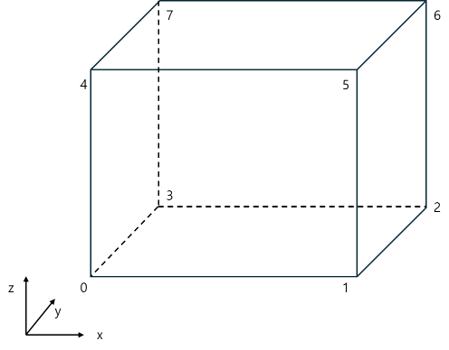
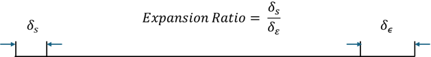

# 🧩 blockMesh

## What is blockMesh?

In this article, we will explore **blockMesh**, the most fundamental meshing utility in OpenFOAM.

In CFD, the mesh is a core component that directly influences both **accuracy** and **computational efficiency**.  
OpenFOAM provides several meshing tools such as **blockMesh** and **snappyHexMesh**.  
Among them, blockMesh is used to generate **structured hexahedral meshes** and is well-suited for simple geometries.  
However, once the geometry becomes even slightly complex, blockMesh quickly becomes impractical due to its limitations.  
For such cases, OpenFOAM provides another utility called **snappyHexMesh**, which we will cover in a future post.

---

## blockMeshDict

To use blockMesh, you must define a file named `blockMeshDict`, located in the `system` directory.  
The example below is the `blockMeshDict` file from the `cavity` tutorial of OpenFOAM-v2412's `icoFoam` case.

```
/*--------------------------------*- C++ -*----------------------------------*\
| =========                 |                                                 |
| \\      /  F ield         | OpenFOAM: The Open Source CFD Toolbox           |
|  \\    /   O peration     | Version:  v2412                                 |
|   \\  /    A nd           | Website:  www.openfoam.com                      |
|    \\/     M anipulation  |                                                 |
\*---------------------------------------------------------------------------*/
FoamFile
{
    version     2.0;
    format      ascii;
    class       dictionary;
    object      blockMeshDict;
}
// * * * * * * * * * * * * * * * * * * * * * * * * * * * * * * * * * * * * * //

scale   0.1;

vertices
(
    (0 0 0) //vertex number 0
    (1 0 0) //vertex number 1
    (1 1 0) //vertex number 2
    (0 1 0) //vertex number 3
    (0 0 0.1) //vertex number 4
    (1 0 0.1) //vertex number 5
    (1 1 0.1) //vertex number 6
    (0 1 0.1) //vertex number 7
);

blocks
(
    hex (0 1 2 3 4 5 6 7) (20 20 1) simpleGrading (1 1 1)
);

edges
(
);

boundary
(
    movingWall
    {
        type wall;
        faces
        (
            (3 7 6 2)
        );
    }
    fixedWalls
    {
        type wall;
        faces
        (
            (0 4 7 3)
            (2 6 5 1)
            (1 5 4 0)
        );
    }
    frontAndBack
    {
        type empty;
        faces
        (
            (0 3 2 1)
            (4 5 6 7)
        );
    }
);


// ************************************************************************* //

```

### blockMeshDict Structure (Header)

```
/*--------------------------------*- C++ -*----------------------------------*\
| =========                 |                                                 |
| \\      /  F ield         | OpenFOAM: The Open Source CFD Toolbox           |
|  \\    /   O peration     | Version:  v2412                                 |
|   \\  /    A nd           | Website:  www.openfoam.com                      |
|    \\/     M anipulation  |                                                 |
\*---------------------------------------------------------------------------*/
FoamFile
{
    version     2.0;
    format      ascii;
    class       dictionary;
    object      blockMeshDict;
}
// * * * * * * * * * * * * * * * * * * * * * * * * * * * * * * * * * * * * * //
```


This section is the **header**, which defines the type and class of the dictionary file.

---

### blockMeshDict Structure (scale & vertices)

```
scale   0.1;

vertices
(
    (0 0 0)
    (1 0 0)
    (1 1 0)
    (0 1 0)
    (0 0 0.1)
    (1 0 0.1)
    (1 1 0.1)
    (0 1 0.1)
);
```

| Keyword    | Description                                       | Example                  |
|------------|---------------------------------------------------|--------------------------|
| `scale`    | Sets the scale factor for the geometry            | `0.001` = mm (default is meters) |
| `vertices` | List of coordinate points used to define blocks   | `(0 0 0)`                |

These 8 vertices define the corners of the mesh.  
Each point is numbered in order from top to bottom, vertex 0 to vertex 7.



---

### blockMeshDict Structure (blocks)

```
blocks
(
    hex (0 1 2 3 4 5 6 7) (20 20 1) simpleGrading (1 1 1)
);
```


| Keyword               | Description                                        |
|-----------------------|----------------------------------------------------|
| `hex (0~7)`           | Set of vertex numbers defining the hexahedral block |
| `(20 20 1)`           | Number of cells in x, y, z directions              |
| `simpleGrading(1 1 1)`| Expansion ratio in each direction                  |

The `blocks` section defines how the mesh is subdivided.  
It includes a list of vertex indices, cell counts per direction, and optional grading information.



---

### blockMeshDict Structure (boundary)

```
boundary
(
    movingWall
    {
        type wall;
        faces
        (
            (3 7 6 2)
        );
    }
    fixedWalls
    {
        type wall;
        faces
        (
            (0 4 7 3)
            (2 6 5 1)
            (1 5 4 0)
        );
    }
    frontAndBack
    {
        type empty;
        faces
        (
            (0 3 2 1)
            (4 5 6 7)
        );
    }
)
```


The `boundary` section defines the mesh boundaries using combinations of vertices.  
Each boundary is made up of 4-point faces (quadrilaterals).  
For example, `movingWall` uses vertices 3, 7, 6, and 2.

---

### Generating the Mesh with blockMesh

To generate the mesh, simply run the following command in your case directory:

```
blockMesh
```

Upon execution, you will see a log output similar to the one below:

```
kdg@LAPTOP-0HV9Q2LJ:~/OpenFOAM/kdg-v2412/run/cavity$ blockMesh
/*---------------------------------------------------------------------------*\
| =========                 |                                                 |
| \\      /  F ield         | OpenFOAM: The Open Source CFD Toolbox           |
|  \\    /   O peration     | Version:  2412                                  |
|   \\  /    A nd           | Website:  www.openfoam.com                      |
|    \\/     M anipulation  |                                                 |
\*---------------------------------------------------------------------------*/
Build  : _8dbc61e11c-20241220 OPENFOAM=2412 version=v2412
Arch   : "LSB;label=32;scalar=64"
Exec   : blockMesh
Date   : Jul 29 2025
Time   : 19:30:09
Host   : LAPTOP-0HV9Q2LJ
PID    : 977
I/O    : uncollated
Case   : /home/kdg/OpenFOAM/kdg-v2412/run/cavity
nProcs : 1
trapFpe: Floating point exception trapping enabled (FOAM_SIGFPE).
fileModificationChecking : Monitoring run-time modified files using timeStampMaster (fileModificationSkew 5, maxFileModificationPolls 20)
allowSystemOperations : Allowing user-supplied system call operations

// * * * * * * * * * * * * * * * * * * * * * * * * * * * * * * * * * * * * * //
Create time

Creating block mesh from "system/blockMeshDict"
Creating block edges
No non-planar block faces defined
Creating topology blocks

Creating topology patches - from boundary section

Creating block mesh topology - scaling/transform applied later

Check topology

        Basic statistics
                Number of internal faces : 0
                Number of boundary faces : 6
                Number of defined boundary faces : 6
                Number of undefined boundary faces : 0
        Checking patch -> block consistency

Creating block offsets
Creating merge list (topological search)...
Deleting polyMesh directory "constant/polyMesh"

Creating polyMesh from blockMesh
Creating patches
Creating cells
Creating points with scale (0.1 0.1 0.1)
    Block 0 cell size :
        i : 0.005 .. 0.005
        j : 0.005 .. 0.005
        k : 0.01 .. 0.01

No patch pairs to merge

Writing polyMesh with 0 cellZones
----------------
Mesh Information
----------------
  boundingBox: (0 0 0) (0.1 0.1 0.01)
  nPoints: 882
  nCells: 400
  nFaces: 1640
  nInternalFaces: 760
----------------
Patches
----------------
  patch 0 (start: 760 size: 20) name: movingWall
  patch 1 (start: 780 size: 60) name: fixedWalls
  patch 2 (start: 840 size: 800) name: frontAndBack

End
```


This confirms that the mesh was successfully generated.


