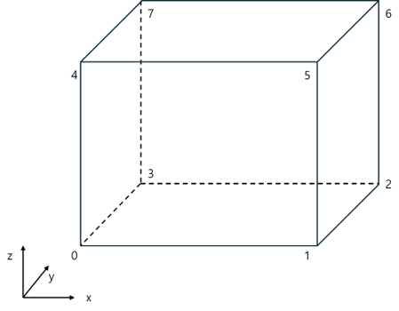
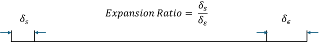
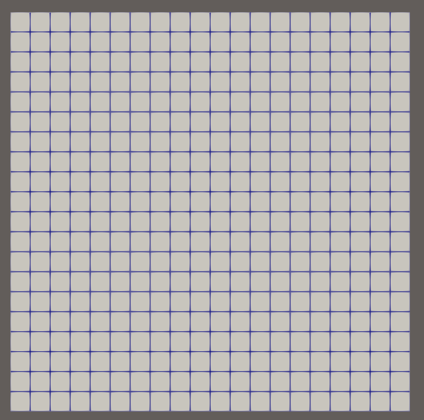

# 🧩 blockMesh

## blockMesh란?

이번 시간에는 OpenFOAM의 격자 유틸리티 중 가장 기본적인 유틸리티인 blockMesh에 대해 알아볼 예정이다.<br>

CFD 해석에서 격자는 해석 정확도와 연산 효율을 결정하는 핵심 요소이다.<br>
OpenFOAM은 blockMesh, snappyHexMesh와 같은 격자 생성 유틸리티를 가지고 있다.<br>
이 때, blockMesh는 정육면체 정렬 격자 (Structure Mesh) 생성을 지원하고 단순한 형상에서 빠른 격자 생성을 지원한다.<br>
하지만 형상이 조금만 복잡해져도 사실상 격자를 생성하기 어렵다는 치명적인 **단점**을 가지고 있다.<br>
그래서 OpenFOAM은 복잡한 형상에서 격자 생성을 위한 **snappyHexMesh** 유틸리티를 제공하고 있다. 이 유틸리티에 대해서는 다음 시간에 알아보도록 하자.<br>

## blockMeshDict
blockMesh를 만들기 위해서는 blockMeshDict를 생성해야 한다.<br>
blockMeshDict를 system 폴더 밑에 위치하며, 내용은 아래와 같다.<br>
참고로 아래 blockMeshDict는 OpenFOAM-V2412의 icoFoam에 있는 cavity라는 예제의 blockMeshDict이다.<br>

```
/*--------------------------------*- C++ -*----------------------------------*\
| =========                 |                                                 |
| \\      /  F ield         | OpenFOAM: The Open Source CFD Toolbox           |
|  \\    /   O peration     | Version:  v2412                                 |
|   \\  /    A nd           | Website:  www.openfoam.com                      |
|    \\/     M anipulation  |                                                 |
\*---------------------------------------------------------------------------*/
FoamFile
{
    version     2.0;
    format      ascii;
    class       dictionary;
    object      blockMeshDict;
}
// * * * * * * * * * * * * * * * * * * * * * * * * * * * * * * * * * * * * * //

scale   0.1;

vertices
(
    (0 0 0) //vertex number 0
    (1 0 0) //vertex number 1
    (1 1 0) //vertex number 2
    (0 1 0) //vertex number 3
    (0 0 0.1) //vertex number 4
    (1 0 0.1) //vertex number 5
    (1 1 0.1) //vertex number 6
    (0 1 0.1) //vertex number 7
);

blocks
(
    hex (0 1 2 3 4 5 6 7) (20 20 1) simpleGrading (1 1 1)
);

edges
(
);

boundary
(
    movingWall
    {
        type wall;
        faces
        (
            (3 7 6 2)
        );
    }
    fixedWalls
    {
        type wall;
        faces
        (
            (0 4 7 3)
            (2 6 5 1)
            (1 5 4 0)
        );
    }
    frontAndBack
    {
        type empty;
        faces
        (
            (0 3 2 1)
            (4 5 6 7)
        );
    }
);


// ************************************************************************* //

```

### blockMeshDict 구조 (헤더)
```
/*--------------------------------*- C++ -*----------------------------------*\
| =========                 |                                                 |
| \\      /  F ield         | OpenFOAM: The Open Source CFD Toolbox           |
|  \\    /   O peration     | Version:  v2412                                 |
|   \\  /    A nd           | Website:  www.openfoam.com                      |
|    \\/     M anipulation  |                                                 |
\*---------------------------------------------------------------------------*/
FoamFile
{
    version     2.0;
    format      ascii;
    class       dictionary;
    object      blockMeshDict;
}
// * * * * * * * * * * * * * * * * * * * * * * * * * * * * * * * * * * * * * //
```
위 내용은 헤더이다. dictonary 파일 형식과 종류에 대해 지정한다.<br>

### blockMeshDict 구조 (scale & vertices)
```
scale   0.1;

vertices
(
    (0 0 0)
    (1 0 0)
    (1 1 0)
    (0 1 0)
    (0 0 0.1)
    (1 0 0.1)
    (1 1 0.1)
    (0 1 0.1)
);
```

| 키워드       | 설명       | 예시 |
|-----------|-----------| -----------|
| scale  | 격자의 크기 (scale)을 지정해주는 요소(factor)이다. | 0.001은 mm 단위로 변환해준다. (OpenFOAM의 길이 기본 단위는 m이다.) |
| vertices  | 점 (vertex)들의 집합(List)이다.  | (0 0 0) |

즉, 위 내용은 0.1로 scale을 진행하며 (0, 0, 0)부터 (0, 1, 0.1) 총 8개의 점들로 blockMesh를 생성한다는 의미이다.<br>
이 때, 맨 위에서부터 차례대로 vertex 0번부터 7번까지 총 8개의 vertex로 이루어져 있다. (아래 그림을 참고하면 된다.) <br>



### blockMeshDict 구조 (blocks)

```
blocks
(
    hex (0 1 2 3 4 5 6 7) (20 20 1) simpleGrading (1 1 1)
);
```
| 키워드       | 설명       |
|-----------|-----------|
| hex (0~7)  | block을 구성하는 vertice들의 집합이다.
| (20 20 1)  | 각 방향 별 격자 수를 나타낸다.  |
| simpleGrading(1 1 1)  | 각 방향 별 격자의 비율을 나타낸다.  |

block 정의는 blocks이라는 이름의 목록에 포함된다.<br>
이 때, vertice들의 목록 (번호), 각 방향 별 격자 수, 각 방향의 셀 비율을 나타내는 목록으로 구성된다.<br>




### blockMeshDict 구조 (boundary)

```
boundary
(
    movingWall
    {
        type wall;
        faces
        (
            (3 7 6 2)
        );
    }
    fixedWalls
    {
        type wall;
        faces
        (
            (0 4 7 3)
            (2 6 5 1)
            (1 5 4 0)
        );
    }
    frontAndBack
    {
        type empty;
        faces
        (
            (0 3 2 1)
            (4 5 6 7)
        );
    }
)
```

마지막으로 boundary들이다.<br>
boundary들은 vertice들의 조합으로 vertice 4개를 조합시켜 하나의 사각형 형태 혹은 3개를 조합시켜 삼각형 형태로 경계면을 정의할 수 있다.<br>
대표적으로 movingWall이라는 경계면은 vertice 3, 7, 6, 2번을 조합하였다.<br>

### blockMesh 생성

blockMesh 생성 방법은 간단하다.<br>
Working directory에서 blockMesh 명령어를 입력하면 격자가 자동으로 생성된다.<br>

```
blockMesh
```

그러면 아래와 같이 로그가 나오면서, 격자 생성이 완료된다.<br>

```
kdg@LAPTOP-0HV9Q2LJ:~/OpenFOAM/kdg-v2412/run/cavity$ blockMesh
/*---------------------------------------------------------------------------*\
| =========                 |                                                 |
| \\      /  F ield         | OpenFOAM: The Open Source CFD Toolbox           |
|  \\    /   O peration     | Version:  2412                                  |
|   \\  /    A nd           | Website:  www.openfoam.com                      |
|    \\/     M anipulation  |                                                 |
\*---------------------------------------------------------------------------*/
Build  : _8dbc61e11c-20241220 OPENFOAM=2412 version=v2412
Arch   : "LSB;label=32;scalar=64"
Exec   : blockMesh
Date   : Jul 29 2025
Time   : 19:30:09
Host   : LAPTOP-0HV9Q2LJ
PID    : 977
I/O    : uncollated
Case   : /home/kdg/OpenFOAM/kdg-v2412/run/cavity
nProcs : 1
trapFpe: Floating point exception trapping enabled (FOAM_SIGFPE).
fileModificationChecking : Monitoring run-time modified files using timeStampMaster (fileModificationSkew 5, maxFileModificationPolls 20)
allowSystemOperations : Allowing user-supplied system call operations

// * * * * * * * * * * * * * * * * * * * * * * * * * * * * * * * * * * * * * //
Create time

Creating block mesh from "system/blockMeshDict"
Creating block edges
No non-planar block faces defined
Creating topology blocks

Creating topology patches - from boundary section

Creating block mesh topology - scaling/transform applied later

Check topology

        Basic statistics
                Number of internal faces : 0
                Number of boundary faces : 6
                Number of defined boundary faces : 6
                Number of undefined boundary faces : 0
        Checking patch -> block consistency

Creating block offsets
Creating merge list (topological search)...
Deleting polyMesh directory "constant/polyMesh"

Creating polyMesh from blockMesh
Creating patches
Creating cells
Creating points with scale (0.1 0.1 0.1)
    Block 0 cell size :
        i : 0.005 .. 0.005
        j : 0.005 .. 0.005
        k : 0.01 .. 0.01

No patch pairs to merge

Writing polyMesh with 0 cellZones
----------------
Mesh Information
----------------
  boundingBox: (0 0 0) (0.1 0.1 0.01)
  nPoints: 882
  nCells: 400
  nFaces: 1640
  nInternalFaces: 760
----------------
Patches
----------------
  patch 0 (start: 760 size: 20) name: movingWall
  patch 1 (start: 780 size: 60) name: fixedWalls
  patch 2 (start: 840 size: 800) name: frontAndBack

End
```

그러면 아래와 같이 격자가 생성된 것을 확인할 수 있다.<br>

