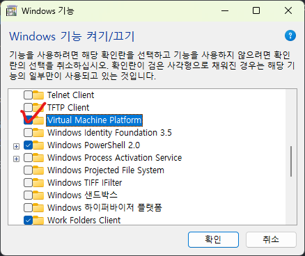
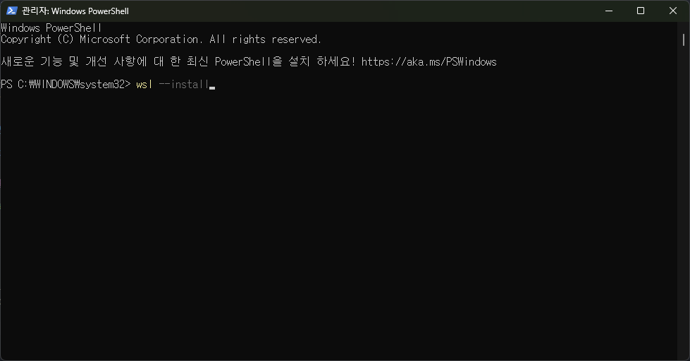
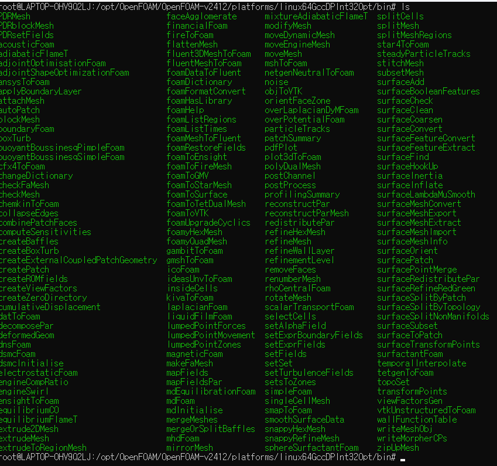

# OpenFOAM (Open Field Operation and Manipulation)

## What is OpenFOAM?

OpenFOAM is a collection of CFD code libraries developed in C++.<br>
This collection includes numerical methods, pre/post-processing tools, and continuum analysis solutions.<br>
OpenFOAM is widely used in many industries, as well as in research and development.<br>
OpenFOAM is generally developed and released by the following three organizations under the GNU GPL V3 license:<br>

* OpenFOAM ESI - ESI Group [OpenFOAM ESI](https://www.openfoam.com/)
* OpenFOAM org - OpenFOAM Foundation [OpenFOAM org](https://openfoam.org/)
* FOAM Extended - Wikki [FOAM extended](http://wikki.co.uk/index.php/foam-extend/)

Additionally, NEXTFOAM develops, modifies, and releases the NextFOAM fork:

* NextFOAM - NEXTFOAM [NextFOAM](https://github.com/nextfoam/nextfoam-cfd)

## Installing OpenFOAM

OpenFOAM primarily runs on Linux. Hence, it needs to be compiled and built on Linux.<br>
That said, it is not impossible to use OpenFOAM on Windows. You can install OpenFOAM using virtualization tools like WSL or Hyper-V.<br>
A virtual machine allows you to create and run a different OS environment within your current Windows system.<br>
This guide will demonstrate how to set up WSL and install OpenFOAM.

**- The installation and setup process is the same for both Linux and WSL.**<br>
**- This guide is based on the following versions:**

+ Windows: Windows 11
+ CPU: Intel i5-1135G7 2.40 GHz
+ WSL: Ubuntu 24.04
+ OpenFOAM: OpenFOAM ESI v2412 (latest version as of January 5, 2025)

### Setting up a Virtual Environment

First, check if your CPU supports virtualization. Most modern Intel CPUs support virtualization.<br>
However, some models may not, so it's important to verify. Below is a guide to check:

Open the Task Manager and go to the "Performance" tab. You should see a screen like the one below:<br>


At the bottom, look for the "Virtualization: Enabled" option.<br>
If it says "Disabled," you'll need to enter the BIOS and enable the virtualization setting.<br>
Refer to this blog for instructions on enabling virtualization in the BIOS:<br>
[BIOS Virtualization Settings](https://m.blog.naver.com/presiddd/222699352932)

Next, go to "Turn Windows Features On or Off" and enable the following settings:<br>

  

**In some cases, you may also need to enable the Windows Hypervisor Platform.**

Restart your computer to complete the virtual environment setup.

### Installing WSL

Once the virtual environment is configured, open PowerShell with administrator privileges.<br>
Run the following command to install WSL:<br>

`wsl --install`



This will automatically install WSL. Afterward, run the following command to list the available distributions:<br>

`wsl -l -o`


Download and install the WSL2 kernel from the link below:<br>
[WSL2 Kernel](https://wslstorestorage.blob.core.windows.net/wslblob/wsl_update_x64.msi)

From the list, identify the OS you wish to install. In this case, we will install Ubuntu 24.04.<br>
Run the following command to install Ubuntu 24.04:<br>

`wsl --install -d Ubuntu-24.04`


The installation process will look like this:<br>


Once installation is complete, create a UNIX username and password.<br>
**Be sure to remember the username and password you set.**


### Installing Required Packages and OpenFOAM

There are several ways to install OpenFOAM, including using binary run files or apt. However, as of January 5, 2025, OpenFOAM cannot be installed using apt on Ubuntu 24.04.<br>
For those who need to modify OpenFOAM source code, we will compile it from source.

#### 1) Installing Required Packages

To compile OpenFOAM, you need several packages and software like openmpi and gcc.<br>
First, update `apt-get` and install the required packages:<br>

```
sudo apt-get update
sudo apt-get install -y build-essential flex zlib1g-dev libgmp-dev libmpfr-dev texinfo cmake
```


Next, install openmpi. OpenMPI is a software that enables communication between nodes and cores.<br>
Run the following command to download the OpenMPI 4.1.6 source code:

`wget https://download.open-mpi.org/release/open-mpi/v4.1/openmpi-4.1.6.tar.gz`

Move the downloaded archive to the shared folder `/opt`:

`sudo cp ./openmpi-4.1.6.tar.gz /opt`

Switch to the administrator account and navigate to the home directory:

```
sudo su
cd
```

Copy the tar file to the current directory and extract it:

```
cp /opt/openmpi-4.1.6.tar.gz .
tar zxf openmpi-4.1.6.tar.gz
```

.png)

Navigate to the extracted folder and compile the OpenMPI source code:

```
cd openmpi-4.1.6
./configure --prefix=/opt/openmpi-4.1.6
make -j 4 all
make install
```

Set the OpenMPI path in the global environment and bash shell:

```
echo 'export PATH=$PATH:/opt/openmpi-4.1.6/bin' >> /etc/bash.bashrc
source /etc/bash.bashrc
```

Verify the installation of OpenMPI 4.1.6 by running:

`mpirun -V`


Next, compile OpenFOAM ESI v2412. Since gcc versions 11 and 13 have known issues with v2306, we will use gcc 9.<br>
Run the following command to install gcc 9:

```
apt install gcc-9 g++-9
```

Change the default gcc version to 9:

```
update-alternatives --install /usr/bin/gcc gcc /usr/bin/gcc-9 10
update-alternatives --install /usr/bin/g++ g++ /usr/bin/g++-9 10
sudo update-alternatives --config gcc
sudo update-alternatives --config g++
```


Download the OpenFOAM source code:

```
wget https://dl.openfoam.com/source/v2412/OpenFOAM-v2412.tgz
wget https://dl.openfoam.com/source/v2412/ThirdParty-v2412.tgz
tar -xvzf OpenFOAM-v2412.tgz
tar -xzvf ThirdParty-v2412.tgz
mkdir -p /opt/OpenFOAM
mv OpenFOAM-v2412 /opt/OpenFOAM
mv ThirdParty-v2412 /opt/OpenFOAM
```


Navigate to the `OpenFOAM-v2412` folder and run `Allwmake` to compile OpenFOAM and its ThirdParty dependencies:

```
cd OpenFOAM-v2412
source ./etc/bashrc
./Allwmake -j 4 all
```


Add the OpenFOAM environment variable to `/etc/bash.bashrc` to simplify launching OpenFOAM:

```
echo "alias of24='. /opt/OpenFOAM/OpenFOAM-v2412/etc/bashrc'" >> /etc/bash.bashrc
```

If you encounter missing binaries (e.g., `pimpleFoam`), navigate to the `solvers` folder and rerun `Allwmake` manually:




Finally, run the `pitzDaily` tutorial to confirm the installation works correctly:


