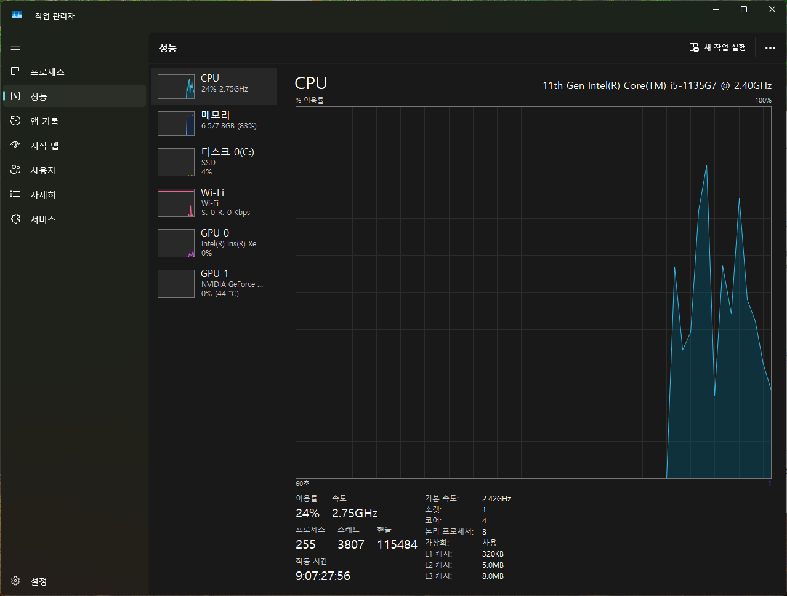
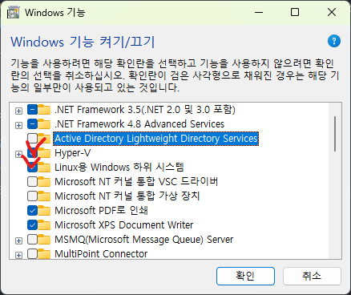
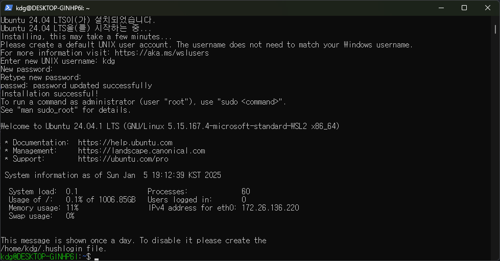
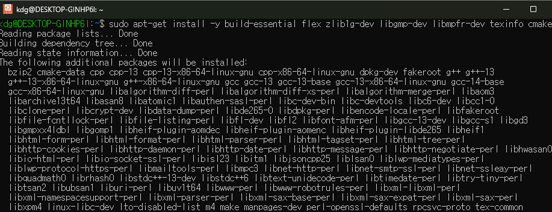
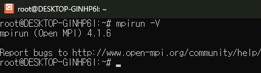
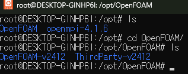
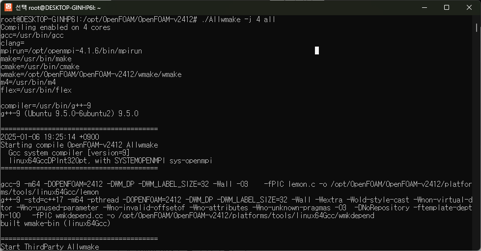
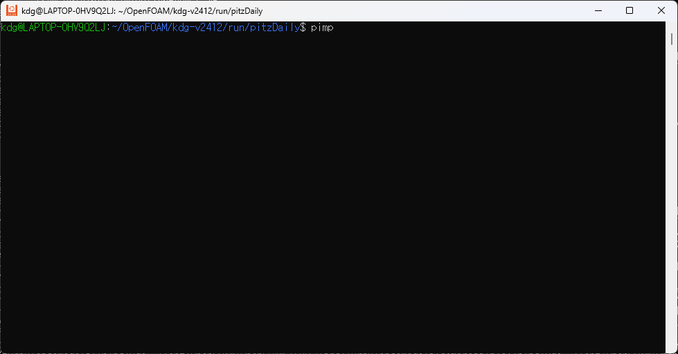

# OpenFOAM (Open Field Operation and Manipulation)

## OpenFOAM이란?

OpenFOAM은 C++을 이용하여 개발 된 CFD 코드 라이브러리 모음이다.<br>
이 모음에는 수치 기법, 전처리 / 후처리를 비롯하여 연속체 해석 솔루션등이 포함되어 있다.<br>
OpenFOAM은 많은 산업 분야를 비롯하여 연구 및 개발에 사용되고 있다.<br>
OpenFOAM은 일반적으로 아래 3단체에서 개발 및 공개를 하고 있으며, GNU GPL V3에 의거하여 공개되고 있다.<br>

* OpenFOAM ESI - ESI Group [OpenFOAM ESI](https://www.openfoam.com/)
* OpenFOAM org - OpenFOAM Foundation [OpenFOAM org](https://openfoam.org/)
* FOAM Extended - Wikki [FOAM extended](http://wikki.co.uk/index.php/foam-extend/)

이외에도 NEXTFOAM에서 개발, 수정 및 공개하고 있는 NextFOAM 포크도 있다.

* NextFOAM - NEXTFOAM [NextFOAM](https://github.com/nextfoam/nextfoam-cfd)

## OpenFOAM 설치 방법

OpenFOAM은 기본적으로 Linux 기반에서 작동을 한다. 하여 Linux에서 컴파일 및 빌드를 해야한다.<br>
그렇다고 Windows에서 OpenFOAM 사용이 불가능 한 것은 아니다. WSL이나 Hyper-V등을 이용한 가상머신을 활용해 OpenFOAM을 설치할 수 있다.<br>
가상머신은 본인 PC 안에 사용 중인 Windows가 아닌 다른 OS의 머신을 만들 수 있는 플랫폼 내지 시스템을 의미한다.<br>
이번 게시글에서는 WSL 및 OpenFOAM 설치 방법을 안내한다.

**- Linux나 WSL 모두 구동 및 설치 방법은 동일하다.**
**- 본 게시글에서는 아래 버전을 기준으로 WSL 및 OpenFOAM 설치 방법을 안내한다.**

+ Windows : Windows 11
+ CPU : intel i5-1135G7 2.40 GHz
+ WSL : Ubuntu 24.04
+ OpenFOAM : OpenFOAM ESI v2412 (2025년 1월 5일 기준 최신판)

### 가상환경 세팅

우선, 본인 CPU가 가상화를 지원하는지 확인해야한다. 사실 요즘 나오는 왠만한 intel CPU들은 가상환경을 지원한다.<br>
그럼에도 불구하고, 가상화를 지원하지 않는 모델이 존재할 수 있으므로 확인 절차를 안내한다.<br>

작업 관리자에서 "성능" 탭 접속을 하면 아래와 같은 화면을 볼 수 있다.<br>



하단에 "가상화 : 사용" 옵션이 있는 것을 볼 수 있다.<br>
이 때, "사용 안 함"으로 되어 있으면 BIOS로 진입하여 세팅을 설정하면 된다.<br>
BIOS 진입 후, CPU 가상화 환경 설정에 대한 안내는 아래 블로그를 참고하여 진행하면 된다.<br>
(BIOS 가상화 설정)[https://m.blog.naver.com/presiddd/222699352932]

이 후, windows 기능 켜기/끄기에서 아래 설정들을 체크한다.<br>

  

**경우에 따라 windows 하이퍼바이저 플랫폼도 체크해야하는 경우가 있다.**

그리고 재부팅을 하면 가상환경 세팅이 완료된다.

### WSL 설치

가상환경 설정이 다 진행되었으면 powershell을 관리자 권한으로 실행한다.<br>
먼저 아래 명령어를 입력하여 wsl 설치를 진행한다.<br>

`wsl --install`


그러면 자동적으로 wsl 설치가 진행된다.<br>
이후, 아래 명령어를 입력하여 설치 가능한 배포 목록을 확인한다.<br>

`wsl -l -o`


또한, 아래 링크에서 WSL2 커널을 받아 설치해준다.
[WSL2 커널](https://wslstorestorage.blob.core.windows.net/wslblob/wsl_update_x64.msi)

목록에서 현재 본인이 설치하고자 하는 OS가 있는지 확인한다. 참고로 지금은 Ubuntu-24.04를 설치할 예정이다.<br>
그리고 아래 명령어를 입력하여 Ubuntu-24.04를 설치한다.<br>

`wsl --install -d Ubuntu-24.04`


아래 그림과 같이 Ubuntu-24.04 설치가 진행되는 모습을 확인할 수 있다.<br>


설치가 완료되면 UNIX 이름 (계정명)과 비밀번호를 입력한다.<br>
**이 때, 입력하는 계정명과 비밀번호는 잊지 않도록 한다.**



### 필요 패키지 및 OpenFOAM 설치

OpenFOAM을 설치하는 방법은 여러 가지가 있다. Binary run 파일로 설치하는 방법 apt로 설치하는 방법 등 다양하게 OpenFOAM을 설치할 수 있다.<br>
하지만, 현재 Ubuntu24.04에서는 apt로 OpenFOAM을 설치하는 방법은 아직 없는 것으로 보인다. (25년 1월 5일 기준)<br>
그리고 OpenFOAM 소스 코드를 직접 수정해서 사용할 누군가를 위해서 소스 코드를 컴파일 하는 방식으로 안내한다.<br>

#### 1) 필요 패키지 설치

OpenFOAM을 컴파일 하기 위해 몇 가지 필요한 패키지 및 소프트웨어들이 있다.<br>
openmpi, gcc 등 몇 가지를 설치해야한다.<br>

우선 아래 명령어를 입력해 apt-get을 업데이트하고, 필요 패키지들을 설치한다.<br>

```
sudo apt-get update
sudo apt-get install -y build-essential flex zlib1g-dev libgmp-dev libmpfr-dev texinfo cmake
```




이후, openmpi를 설치한다. openmpi는 node간 통신을 위해 개발된 소프트웨어로 openmp의 기능도 포함하고 있어 core간 통신도 가능하게 한다.<br>
ESI에서는 현재 openmpi 2와 3의 특정 버전에서 know issue가 있으므로 최소 권장 사항을 지정하고 있다.<br>
하지만 openpmi 2와 3은 옛날 버전의 mpi로 현재는 openmpi 4 혹은 5가 있다. 필자는 openmpi 5는 아직 테스트를 하지 않아 (분명 아직 불안정할 것이라고 추측된다.) openmpi 4.1.6으로 설치한다.<br>
아래 명령어를 입력해 openmpi 4.1.6의 소스코드를 다운로드 받는다.<br>

`wget https://download.open-mpi.org/release/open-mpi/v4.1/openmpi-4.1.6.tar.gz`

이후 받은 압축 파일을 공유 폴더인 /opt로 옮겨준다.<br>

`sudo cp ./openmpi-4.1.6.tar.gz /opt`

그리고 관리자 계정으로 접속하여 관리자의 계정 폴더로 이동한다.<br>

```
sudo su
cd
```

이 위치로 tar 파일을 복사하고 압축해제 한다.<br>

```
cp /opt/openmpi-4.1.6.tar.gz .
tar zxf openmpi-4.1.6.tar.gz
```

.png)

압축 해제한 폴더로 이동하여 openmpi 소스코드를 컴파일 한다.

```
cd openmpi-4.1.6
./configure --prefix=/opt/openmpi-4.1.6
make -j 4 all
make install
```

그리고 전역 환경 및 bash shell에 openmpi 경로를 설정한다.<br>

```
echo 'export PATH=$PATH:/opt/openmpi-4.1.6/bin' >> /etc/bash.bashrc
source /etc/bash.bashrc
```

이후 아래 명령어를 입력하여 openmpi-4.1.6이 정상적으로 설치되었음을 확인한다.<br>

`mpirun -V`



다음으로 OpenFOAM을 컴파일한다.<br>
OpenFOAM은 ESI의 v2412 버전을 컴파일한다.<br>
v2306에서 gcc11과 gcc13으로 컴파일이 되지 않는 문제가 발생하였고, 이 문제는 아직 해결되지 않은 것으로 보인다.<br>
그래서 gcc9 버전을 설치한다.<br>
아래 명령어를 입력해 gcc9 버전을 설치한다.<br>

**gcc의 문제가 아닌 필자 노트북의 메모리 부족으로 인해 발생한 문제이다. 그래서 gcc 13으로 진행해도 문제 없다.**

```
apt install gcc-9 g++-9
```
이후, 기본으로 설정되어 있는 gcc 버전을 9로 바꾼다.<br>

```
update-alternatives --install /usr/bin/gcc gcc /usr/bin/gcc-9 10
update-alternatives --install /usr/bin/g++ g++ /usr/bin/g++-9 10
sudo update-alternatives --config gcc
sudo update-alternatives --config g++
```


gcc 버전을 9로 변경하였으면 OpenFOAM 소스 코드를 다운로드 받는다.<br>

```
wget https://dl.openfoam.com/source/v2412/OpenFOAM-v2412.tgz
wget https://dl.openfoam.com/source/v2412/ThirdParty-v2412.tgz
tar -xvzf OpenFOAM-v2412.tgz
tar -xzvf ThirdParty-v2412.tgz
mkdir -p /opt/OpenFOAM
mv OpenFOAM-v2412 /opt/OpenFOAM
mv ThirdParty-v2412 /opt/OpenFOAM
```



OpenFOAM-v2412 폴더로 이동하고 Allwmake를 실행하여 OpenFOAM을 컴파일한다.<br>
이 때, ThirdParty도 같이 컴파일된다.

```
cd OpenFOAM-v2412
source ./etc/bashrc
./Allwmake -j 4 all
```



설치가 전부 진행되면 아래 명령어를 입력해 /etc/bash.bashrc에 OpenFOAM 환경 변수를 추가하자.<br>
이렇게 하면 앞으로 터미널에 of24만 입력하고도 OpenFOAM을 실행할 수 있다.<br>

```
echo "alias of24='. /opt/OpenFOAM/OpenFOAM-v2412/etc/bashrc'" >> /etc/bash.bashrc
```

설치가 전부 진행된 줄 알고 예제를 실행하다 보니 pimpleFoam, simpleFoam등 기본적인 binary 파일이 실행되지 않는 것이다.<br>



이상한 생각이 들어 $FOAM_APPBIN으로 가봤더니, 이게 왠걸 솔버들이 전혀 컴파일 되지 않았다. 하여, solvers 폴더는 직접 다시 ./Allwmake를 실행하여 컴파일 하였다.<br>


그 후, 다시 pitzDaily 예제를 돌렸더니 정상적으로 잘 돌아가는 모습이다.<br>

